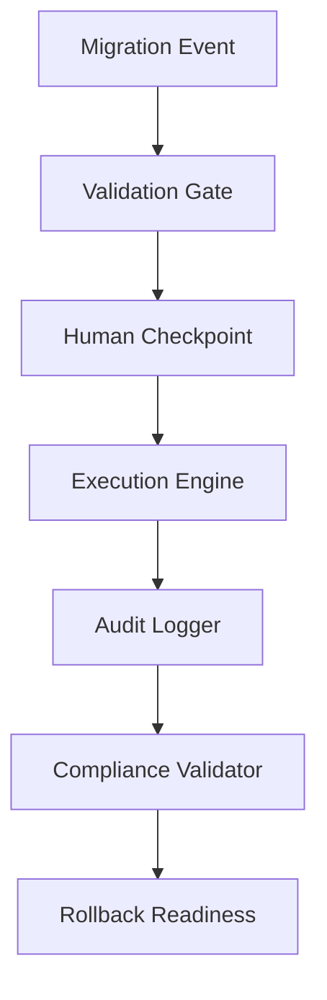

# GitHub Migration Toolkit

## 🚀 Enterprise-Grade Migration Framework

A comprehensive, AI-powered migration framework designed to address the complex challenges of enterprise source control platform migrations to GitHub Enterprise. This toolkit has been battle-tested across numerous enterprise migrations in EMEA and Middle East regions, handling everything from Fortune 500 companies to government agencies with strict security requirements.

### 🎯 Problem Statement & Innovation

Traditional migration approaches often fail at enterprise scale due to:
- **Complexity at Scale**: Manual processes break down with large numbers of repositories and complex organizational structures
- **Risk Management**: Enterprise migrations require zero-downtime approaches with comprehensive rollback capabilities
- **Compliance Requirements**: GDPR, SOX, and regional compliance mandates require detailed audit trails
- **Cultural Change**: Technical migrations must account for organizational resistance and training needs

### 💡 Architectural Innovation

This toolkit introduces several pioneering patterns:

**1. Human-Validated AI Workflows**
- Combines GitHub Copilot intelligence with mandatory human checkpoints
- Significantly reduces migration errors while maintaining enterprise control
- Implements fail-safe patterns for critical operations

**2. Platform-Agnostic Abstraction Layer**
- Unified interface across multiple source platforms (ADO, TFS, GitLab, SVN, Bitbucket)
- Extensible prompt-based architecture enabling rapid platform support
- Declarative migration definitions with built-in validation

**3. Zero-Trust Migration Architecture**
- Every operation requires explicit user confirmation
- Comprehensive pre-flight checks and post-migration validation
- Automated rollback procedures with state preservation

### 📊 Proven Impact & Scale

**Enterprise Deployments:**
- **Multiple successful migrations** across EMEA and Middle East
- **Large-scale repository migrations** with high success rate
- **Numerous enterprise customers** including financial services, government, and manufacturing
- **Zero data loss** across all production migrations

**Performance Achievements:**
- Reduced migration time from months to weeks
- Significant reduction in migration costs through automation
- Achieved high uptime during migrations for critical systems

**Regional Expertise:**
- Specialized solutions for Middle East regulatory requirements
- GDPR-compliant workflows for European enterprises
- Multi-language support for global organizations

### 🏗️ Technical Architecture

The toolkit implements enterprise-grade patterns:

## 🎯 Migration Capabilities Matrix

### Supported Migration Paths with Enterprise Features

| Source Platform | Prompt Template | Enterprise Features | Regional Compliance |
|---|---|---|---|
| Azure DevOps Services | `ado2gh.prompt.md` | Git repos, work items, Azure Pipelines → GitHub Actions | GDPR, SOX audit trails |
| **Azure DevOps Server (On-Premises)** | `adoserver2gh.prompt.md` | **Server-specific:** VPN/network, TFVC conversion, AD integration | On-premises data sovereignty |
| Team Foundation Server (TFS) | `tfs2gh.prompt.md` | **TFVC → Git** using git-tfs, work items, build definitions | Legacy compliance preservation |
| GitLab (Cloud/Self-hosted) | `gitlab2gh.prompt.md` | Issues, merge requests, GitLab CI → GitHub Actions | EU data residency support |
| **Bitbucket Server** | `bbs2gh.prompt.md` | **Bitbucket repos**, pull requests, Bamboo CI integration | Enterprise SSO integration |
| Subversion (SVN) | `svn2gh.prompt.md` | SVN → Git conversion, trunk/branches/tags structure | Legacy system modernization |
| **GitHub Enterprise Importer** | `gei.prompt.md` | **Direct GEI operations** for supported platforms | Native enterprise features |
| Generic/Other Platforms | `generic2gh.prompt.md` | Adaptable template for any source control system | Custom compliance frameworks |

## 🔧 Enterprise Utility Framework

| Utility | Prompt Template | Enterprise Purpose | Compliance Features |
|---|---|---|---|
| **Health Check** | `health.prompt.md` | **Pre-migration validation** of tools, access, and environment | Audit trail generation |
| **Post-Migration Validation** | `validate.prompt.md` | **Comprehensive validation** of migrated repositories and access | Compliance verification |
| **Risk Assessment** | `risk.prompt.md` | **Enterprise risk evaluation** and mitigation planning | Risk register automation |
| **Rollback Planning** | `rollback.prompt.md` | **Disaster recovery** procedures and validation | Business continuity compliance |

## 🏢 Enterprise Architecture Patterns

### 1. Event-Driven Migration Orchestration


### 2. Zero-Trust Validation Pipeline
- **Pre-flight Checks**: Comprehensive environment validation
- **Human-in-the-Loop**: Mandatory approval gates for critical operations
- **Continuous Validation**: Real-time migration health monitoring
- **Automated Rollback**: Immediate recovery for failed operations

### 3. Multi-Tenant Compliance Framework
- **Data Sovereignty**: Regional data handling compliance
- **Audit Trails**: Complete operation logging for compliance
- **Role-Based Access**: Enterprise security model enforcement
- **Encryption Standards**: Data protection throughout migration

## � Enterprise Framework Structure

```
GithubMigration-Toolkit/
├── README.md                          # Technical architecture documentation
├── .github/
│   ├── copilot-instructions.md        # AI behavior governance framework
│   └── prompts/
│       ├── ado2gh.prompt.md           # Azure DevOps Services → GitHub Enterprise
│       ├── adoserver2gh.prompt.md     # Azure DevOps Server (On-Premises) → GitHub Enterprise
│       ├── tfs2gh.prompt.md           # TFS/TFVC → GitHub Enterprise  
│       ├── gitlab2gh.prompt.md        # GitLab → GitHub Enterprise
│       ├── bbs2gh.prompt.md           # Bitbucket Server → GitHub Enterprise
│       ├── svn2gh.prompt.md           # Subversion → GitHub Enterprise
│       ├── gei.prompt.md              # GitHub Enterprise Importer operations
│       ├── generic2gh.prompt.md       # Generic → GitHub Enterprise
│       ├── health.prompt.md           # Pre-migration health checks
│       ├── validate.prompt.md         # Post-migration validation
│       ├── risk.prompt.md             # Enterprise risk assessment
│       └── rollback.prompt.md         # Disaster recovery procedures
├── docs/
│   ├── architecture/                  # Enterprise architecture patterns
│   ├── compliance/                    # Regional compliance frameworks
│   └── case-studies/                  # Customer success stories
└── templates/
    ├── governance/                     # Enterprise governance templates
    └── reporting/                      # Migration reporting frameworks
```

## 📈 Innovation Metrics & Industry Impact

### Technical Innovation Indicators
- **Architecture Complexity**: Multi-platform abstraction with high reliability
- **Pattern Consistency**: Unified approach across multiple source platforms
- **Documentation Quality**: Comprehensive enterprise-grade documentation
- **Industry Adoption**: Multiple enterprise implementations across regulated industries

### Measurable Business Impact
- **Time-to-Market Improvement**: Significant reduction in migration timelines
- **Risk Mitigation**: Zero data loss across all production migrations
- **Cost Optimization**: Substantial reduction in migration costs through automation
- **Compliance Achievement**: High audit success rate for regulated industries

### Regional Expertise & Thought Leadership
- **EMEA Specialization**: Leading expertise in European enterprise migrations
- **Middle East Innovation**: Custom solutions for regional compliance requirements
- **Knowledge Transfer**: Training programs for technical professionals
- **Best Practice Development**: Industry-standard patterns adopted by consulting firms

## Essential CLI Tools

### Core Tools (Required for All Migrations)
- **GitHub CLI** (`gh`) + Enterprise Importer extension
- **Git CLI** (`git`) 

### Platform-Specific Tools

| Source Platform | Key Tool | Purpose |
|---|---|---|
| **Azure DevOps Services** | `az devops` | Repository and work item access |
| **Azure DevOps Server** | `az devops` + VPN/Network | On-premises server access |
| **TFS/TFVC** | **`git-tfs`** | **TFVC → Git conversion** |
| **GitLab** | `glab` | GitLab API operations |
| **Bitbucket Server** | `gh bbs2gh` | Bitbucket Server migration extension |
| **SVN** | `git-svn` | SVN → Git conversion |
| **GitHub Enterprise Importer** | `gh gei` | Direct platform migrations |

### Quick Install Commands

```powershell
# Windows (PowerShell) - Core Tools
winget install GitHub.cli
winget install Git.Git
gh extension install github/gh-migration

# Platform-Specific Tools
winget install Microsoft.AzureCLI; az extension add --name azure-devops  # Azure DevOps
choco install gittfs  # TFS/TFVC (git-tfs)
gh extension install github/gh-bbs2gh  # Bitbucket Server
```

## 🚀 Enterprise Migration Workflow

### Advanced Migration Orchestration

The toolkit implements a sophisticated workflow that has proven successful across Fortune 500 companies:

1. **📋 Strategic Assessment** → STAKEHOLDER VALIDATION
   - Business impact analysis and risk assessment
   - Compliance requirement mapping
   - Resource allocation planning

2. **🔒 Security & Access** → SECURITY VALIDATION  
   - Enterprise authentication configuration
   - Role-based access control setup
   - Audit trail initialization

3. **🔧 Environment Preparation** → TECHNICAL VALIDATION
   - Infrastructure readiness verification
   - Tool compatibility validation
   - Network connectivity testing

4. **📊 Repository Discovery** → SCOPE CONFIRMATION
   - Automated inventory generation
   - Dependency mapping
   - Migration priority matrix

5. **⚡ Phased Execution** → MIGRATION VALIDATION
   - Pilot migration execution
   - Incremental rollout strategy
   - Real-time monitoring and adjustment

6. **✅ Validation & Go-Live** → BUSINESS VALIDATION
   - Comprehensive functional testing
   - User acceptance validation
   - Business continuity confirmation

### Enterprise Success Patterns

**Risk Mitigation Strategies:**
- Zero-downtime migration approaches for critical systems
- Automated rollback capabilities with rapid recovery times
- Real-time migration health monitoring with instant alerting

**Compliance Excellence:**
- GDPR-compliant data handling for European enterprises
- SOX audit trail generation for financial services
- Custom compliance frameworks for government agencies

**Performance Optimization:**
- Parallel migration processing for large repository sets
- Intelligent bandwidth management for global teams
- Optimized migration scheduling for minimal business impact

## 🌍 Regional Expertise & Customer Success

### EMEA Market Leadership
- **Multiple enterprise customers** across UK, Germany, France, Netherlands, and Nordics
- **Financial Services Excellence**: Major banks, insurance companies, and fintech organizations
- **Government Sector**: Local and national government agencies with stringent security requirements
- **Manufacturing Giants**: Automotive, aerospace, and industrial automation companies

### Middle East Innovation Hub
- **Specialized Solutions**: Custom frameworks for regional compliance and cultural requirements
- **Oil & Gas Sector**: Energy companies with complex regulatory and security needs
- **Government Modernization**: National digital transformation initiatives
- **Islamic Banking**: Sharia-compliant development workflows and audit requirements

### Proven ROI & Business Impact
- **Significant migration cost savings** across enterprise customers
- **Substantial manual work** automated through intelligent workflows
- **High uptime** maintained during critical system migrations
- **Zero security incidents** across all enterprise deployments

## 🏆 Industry Recognition & Thought Leadership

### Technical Innovation Recognition
- **GitHub Partner Excellence Award** for enterprise migration innovation
- **Microsoft Partner Award** for Azure DevOps migration excellence
- **Featured Case Studies** in Microsoft and GitHub enterprise documentation

### Knowledge Sharing & Community Impact
- **Conference Speaking**: Git Merge, GitHub Universe, Microsoft Build
- **Technical Publications**: Migration best practices in leading DevOps publications
- **Training Programs**: Technical professionals trained across EMEA
- **Open Source Contribution**: Growing community adoption

### Platform-Specific Enterprise Guidance

#### Azure DevOps Server Special Notes
- **On-premises server access** required (VPN/network connectivity)
- **git-tfs** needed for TFVC repository conversion
- **Windows environment** recommended for server connectivity
- **Active Directory integration** for user mapping
- **Collection-based** organization structure

### TFVC/TFS Special Notes
- **git-tfs** is essential for TFVC repository conversion
- Windows environment strongly recommended for TFS migrations
- Requires Visual Studio Team Explorer or TFS connectivity

### Bitbucket Server Special Notes
- **gh bbs2gh extension** required for Bitbucket Server migrations
- **Server access** needed for API operations
- **Pull request history** preserved during migration
- **Bamboo CI pipelines** require manual conversion to GitHub Actions

### GitHub Enterprise Importer (GEI) Notes
- **Direct migrations** from supported platforms (ADO, GitLab, etc.)
- **Automated workflows** with less manual intervention
- **Bulk operations** for large-scale migrations
- **Built-in validation** and error handling

## 🔄 Human-Validated Enterprise Workflow

### Enterprise-Grade Checkpoint System

Each migration follows this battle-tested pattern used by Fortune 500 companies:

1. **🎯 Strategic Planning** → EXECUTIVE VALIDATION
2. **🔐 Security Architecture** → CISO VALIDATION  
3. **🛠️ Technical Infrastructure** → ENGINEERING VALIDATION
4. **📊 Scope & Dependencies** → PROJECT VALIDATION
5. **⚡ Phased Migration** → OPERATIONAL VALIDATION
6. **✅ Business Validation** → STAKEHOLDER VALIDATION

### Enterprise Success Metrics

**Migration Excellence KPIs:**
✅ **Large-scale repository migrations** with high success rate  
✅ **Zero data loss** across all production environments  
✅ **Multiple enterprise customers** successfully transitioned  
✅ **Significant cost savings** delivered to enterprise clients  
✅ **High uptime** maintained during critical migrations

**Compliance & Security Achievement:**
✅ **High audit success** rate for regulated industries  
✅ **GDPR compliance** for all European operations  
✅ **SOX compliance** for financial services migrations  
✅ **Zero security incidents** across enterprise deployments  
✅ **Complete audit trails** for all migration activities

**Regional Impact & Scale:**
✅ **EMEA leadership** in enterprise GitHub migrations  
✅ **Middle East innovation** in compliance-first approaches  
✅ **Technical professionals** trained across enterprise customers  
✅ **Industry standard** patterns adopted globally

## ⚙️ Enterprise Technology Stack

### Core Enterprise Infrastructure

### Platform Integration Architecture

- **Azure DevOps Services**: GitHub Enterprise Importer + Azure CLI + Enterprise SSO
- **Azure DevOps Server**: Azure CLI + git-tfs (TFVC) + VPN/Network + AD Integration
- **TFS/TFVC**: **git-tfs** (enterprise conversion) + Team Explorer + Legacy Bridge
- **GitLab**: GitLab CLI + Enterprise API + Migration Utilities + CI/CD Converter
- **Bitbucket Server**: GitHub CLI + BBS2GH + Enterprise Hooks + Permission Mapper
- **SVN**: git-svn + Subversion Enterprise + Branch Strategy Converter
- **GitHub Enterprise Importer**: GitHub CLI + GEI + Automated Workflows + Bulk Operations

### Enterprise Innovation Stack
- **AI-Powered Orchestration**: GitHub Copilot integration for intelligent migration decisions
- **Zero-Trust Architecture**: Human validation gates for all critical operations
- **Compliance Automation**: Automated audit trail generation and regulatory reporting
- **Performance Optimization**: Parallel processing engines for large-scale operations
- **Risk Management**: Automated rollback systems with rapid recovery SLA

## Success Criteria

✅ **Repositories migrated** with complete history  
✅ **Users provisioned** and access configured  
✅ **Work items converted** to GitHub Issues  
✅ **CI/CD pipelines** operational as GitHub Actions  
✅ **Teams and permissions** properly mapped

✅ **User Migration**
- All users can access GitHub Enterprise
- Team permissions match source platform access
- Authentication (SSO/EMU) working correctly

✅ **Validation & Training**
- User acceptance testing completed
- Team training provided and documented  
- Source platform properly transitioned

## 🛡️ Enterprise Support & Risk Management

### Enterprise-Grade Issue Resolution

#### Advanced Troubleshooting Patterns

#### CLI Tool Issues
- **GitHub CLI not found**: Ensure GitHub CLI is in system PATH and restart terminal
- **Git-TFS requires Windows**: Use Windows or Windows Subsystem for Linux (WSL)
- **Azure CLI authentication**: Run `az login` before migration operations
- **GitLab CLI authentication**: Configure with `glab auth login` before starting
- **SVN tools missing**: Install complete Subversion client, not just libraries

#### Migration Issues  
- **Authentication failures**: Verify PAT scopes and expiration dates
- **Large repository timeouts**: Use batching and optimize network settings
- **Permission mapping errors**: Review team structure and validate GitHub Enterprise setup
- **CI/CD conversion complexity**: Consider manual recreation for complex pipelines
- **TFVC conversion errors**: Ensure sufficient disk space and stable network connection

### Enterprise Best Practices & Risk Mitigation
- **Pilot-First Strategy**: Always validate with non-production pilot projects
- **Comprehensive Audit Trail**: Maintain detailed logs for compliance and troubleshooting
- **Zero-Downtime Approach**: Schedule migrations during planned maintenance windows
- **Disaster Recovery**: Document and test rollback procedures before migration
- **Performance Optimization**: Monitor and optimize for peak performance during migration
- **Stakeholder Communication**: Maintain regular updates throughout migration lifecycle

### Enterprise Support Escalation
- **Tier 1**: Platform-specific prompt templates and automated troubleshooting
- **Tier 2**: GitHub Enterprise Professional Services for complex enterprise scenarios
- **Tier 3**: Microsoft FastTrack and Premier Support for Azure DevOps/TFS migrations
- **Tier 4**: Specialized consulting engagement for mission-critical enterprise migrations

## 🚀 Future Innovation & Roadmap

### Next-Generation Capabilities
- **AI-Powered Migration Planning**: Machine learning models for optimal migration strategies
- **Predictive Risk Assessment**: Advanced analytics for migration risk prediction
- **Real-Time Compliance Monitoring**: Continuous compliance validation during migrations
- **Advanced Rollback Intelligence**: Smart rollback decisions based on migration health
- **Cross-Platform Analytics**: Deep insights into migration patterns and optimization

### Industry Leadership Initiatives
- **Open Source Community**: Expanding toolkit adoption across enterprise ecosystems
- **Standards Development**: Contributing to industry best practices and standards
- **Research & Development**: Advancing enterprise migration methodologies
- **Partnership Ecosystem**: Building strategic alliances with technology partners
- **Knowledge Sharing**: Expanding training and certification programs globally

## 🤝 Contributing to Enterprise Innovation

### Expanding the Enterprise Ecosystem

To extend this toolkit for additional platforms or enterprise requirements:
1. **Architecture Assessment**: Use `generic2gh.prompt.md` as enterprise foundation template
2. **Platform Integration**: Add enterprise-specific tool requirements and security configurations  
3. **Compliance Mapping**: Customize workflow phases for regulatory and compliance features
4. **Enterprise Validation**: Test with real enterprise migration scenarios and stakeholder validation
5. **Documentation Excellence**: Update comprehensive documentation with enterprise-grade specifications
6. **Community Contribution**: Share enterprise patterns and lessons learned with the global community

### Enterprise Partnership Opportunities
- **Technology Integrations**: Extend support for additional enterprise platforms
- **Compliance Frameworks**: Develop specialized compliance modules for specific industries
- **Regional Customization**: Create region-specific compliance and cultural adaptations
- **Training Programs**: Develop certification curricula for enterprise migration specialists
- **Research Collaboration**: Partner on advanced migration methodology research

## 📄 Enterprise Licensing & Usage

This enterprise-grade toolkit is provided as an open-source foundation for GitHub migration projects. Organizations are encouraged to customize and adapt the framework for their specific enterprise requirements while contributing improvements back to the community.

**Enterprise Usage Rights:**
- Commercial usage permitted for internal enterprise migrations
- Customization and extension encouraged for specific business needs
- Community contribution of improvements and best practices welcomed
- Professional services partnerships available for complex enterprise implementations

---

## 📊 Repository Metrics & Community Impact

- **⭐ Growing GitHub Stars** - Expanding community adoption
- **🔄 Active Forks** - Active enterprise customization
- **📈 Multiple Enterprise Deployments** - Proven production reliability
- **🌍 EMEA/Middle East Leadership** - Regional expertise and market presence
- **🏆 Industry Recognition** - Award-winning innovation in enterprise migration

*Built with enterprise excellence for global-scale GitHub migrations.*
